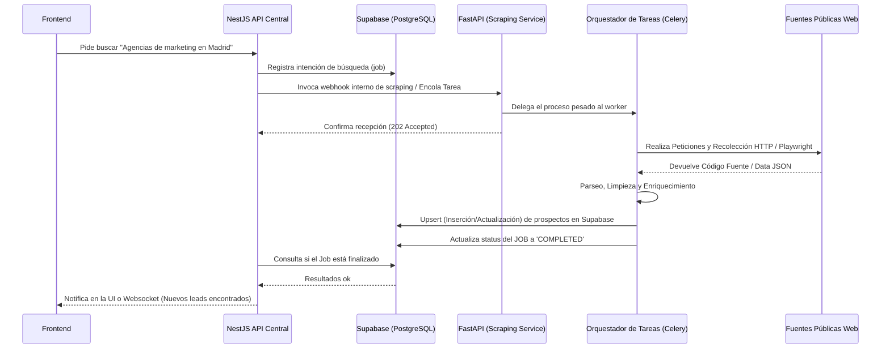

# Arquitectura Oficial (Fase de Producción)

Una vez probado y validado que el motor de extracción funciona y que los datos recuperables aportan valor al propósito comercial, el servicio de Scraping se insertará formalmente en la arquitectura SaaS de la plataforma.

## Ecosistema Completo de la Plataforma

En producción, convivirán múltiples piezas especializadas para cubrir todo el flujo desde el descubrimiento hasta el seguimiento comercial:

1. **Frontend (Aplicación Cliente)**: React, Vue, o la tecnología decidida, donde el usuario interactúa visualmente.
2. **Backend Principal (NestJS)**: Núcleo del negocio. Gestiona roles, JWTs, Workspaces, pipelines de ventas de los CRM, pagos e integraciones finales de negocio.
3. **Servicio de Scraping (FastAPI)**: El proyecto actual, actuando como un worker backend interno, sin exposición pública.
4. **Base de Datos Central (Supabase / Postgres)**: Fuente de verdad compartida. Contendrá los datos de usuarios, y también los de prospectos, a los cuales tanto NestJS (lectura/presentación) como FastAPI (inserción/enriquecimiento) tendrán acceso.
5. **Broker de Mensajería y Colas (Redis + Celery/BullMQ)** *(Potencial)*: Para gestionar la coordinación asíncrona robusta.

## Diagrama del Flujo Definitivo

## Cambios respectos al MVP Temporal

- **Migración de Docker a Supabase**: La base de datos local se deshecha. Las conexiones de los ORMs en FastAPI se actualizarán a la URI de entorno de producción proporcionada por Supabase (ej. usando connection pooling con PgBouncer).
- **Control de Acceso Interno**: Los endpoints de FastAPI implementarán validación de tokens o uso de API Keys de servidor-a-servidor (`X-Internal-Token`) para que solo solicitudes procedentes de la red privada (NestJS) sean ejecutadas.
- **Escalabilidad de Colas**: Se dejarán de usar `BackgroundTasks` nativos y se usarán workers independientes de Python suscritos a colas, o se dejará que NestJS publique tareas de Scraping mediante BullMQ/Redis si se quiere una única tecnología gestionando colas.
- **Despliegue Diferenciado**: El servicio en FastAPI se empaquetará en su propio contenedor de producción y se desplegará en un servicio de hosting en la nube (ej. Render, AWS, GCP, o en el servidor corporativo), separándolo físicamente del contenedor en NestJS.
